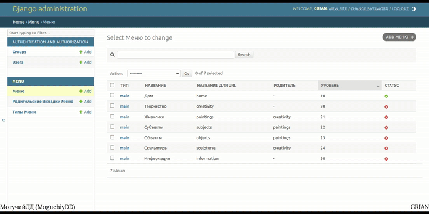

# Django/UpTrader
**FullStack**. Create and Edit a submenu through the database

The project was created and tested on the **Linux Ubuntu 22.04 Wayland** OS



## Information
<div id="information" align="left">
  <a href="https://github.com/MoguchiyDD" target="_blank">
    
  </a>
  <a href="../../../LICENSE" target="_blank">
    
  </a>
  
  
</div>

## URL Addresses
- http://localhost:8000 : The MAIN Page
- http://localhost:8000/creativity : The CREATIVITY Page
- http://localhost:8000/creativity/paintings : The PAINTINGS Page
- http://localhost:8000/creativity/paintings/subjects : The SUBJECTS Page
- http://localhost:8000/creativity/paintings/objects : The OBJECTS Page
- http://localhost:8000/creativity/sculptures : The SCULPTURES Page
- http://localhost:8000/information : The INFORMATION Page

## MENU TABS
- home (URL)
- creativity (URL)
  - paintings (URL, Parent: creativity)
    - subjects (URL, Parent: paintings)
    - objects (URL, Parent: paintings)
  - sculptures (URL, Parent: creativity)
- information (URL)

## Installed
<div id="installed" align="left">
  <a href="https://pypi.org/project/Django/" target="_blank">
    
  </a>
</div>

## Commands
```Bash
# Virtual Window (Python)
$ python -m venv <NAME>
# for Linux and MacOS : source <NAME>/bin/activate
# for Windows : <NAME>\Scripts\activate
$ pip install -r requirements.txt  # Installation of Packages 

# RUN
$ cd src
$ python manage.py makemigrations menu
$ python manage.py migrate
# Create 1 SUPER USER and ADD 1 MENU (type «main») following the INSTRUCTION
# in the «MENU TABS» Block from the «README.md» to the MENU DATABASE
# (the parent is saved automatically when creating 1 new tab for the menu)
$ python manage.py runserver
```
