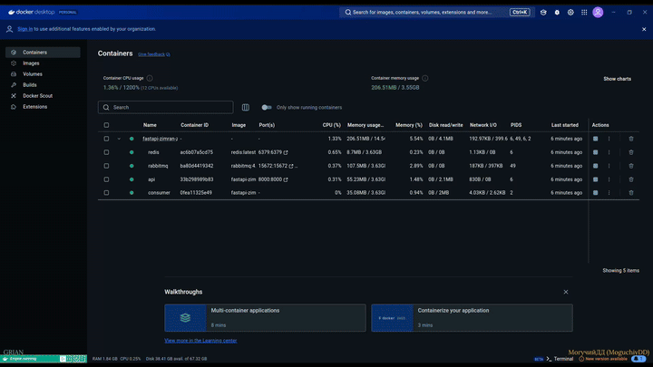

# FastAPI/Zimran (1st) | #16
**BackEnd**. The request is sent to FastAPI, where the data is stored in Redis and a message with a command and UUID is generated for RabbitMQ. The RabbitMQ consumer receives this message, retrieves the data from Redis using the UUID, processes it, and saves it back to Redis. FastAPI waits for the processing result for up to 30 seconds by checking the data in Redis. If the processing is successful, a status of 200 is returned. If the time limit is exceeded, a status of 408 is sent. An asynchronous approach is used for all processes.

**Stack**: Asynchronous, FastAPI, Redis, RabbitMQ, Docker

[API endpoint](./API.md)



## Information
<div id="information" align="left">
  <a href="https://github.com/MoguchiyDD" target="_blank">
    
  </a>
  <a href="../../../LICENSE" target="_blank">
    
  </a>
  
  
  <a href="https://youtu.be/hLqqkCG4OAo" target="_blank">
    
  </a>
</div>

## Steps before launch
```bash
$ docker compose up --build
```
