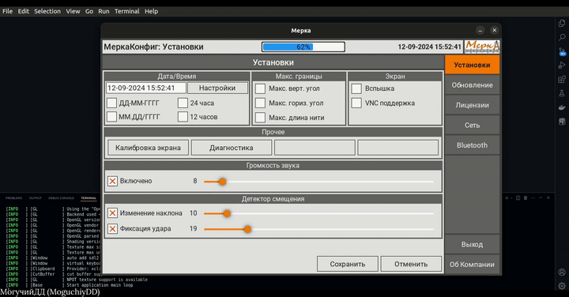

# Kivy/SIMUComp (1st) | #6
**FrontEnd**. Desktop software design. It was required to create only one tab without functionality

**Stack**: Python, Kivy



## Information
<div id="information" align="left">
  <a href="https://github.com/MoguchiyDD" target="_blank">
    
  </a>
  <a href="../../../LICENSE" target="_blank">
    
  </a>
  
  <a href="https://youtu.be/IzQOuXnBJ0E" target="_blank">
    
  </a>
</div>

## Steps before launch
```BASH
$ # 1 OPTION
$ docker build -t simucomp .
$ xhost +local:docker
$ docker run --rm -e DISPLAY=$DISPLAY -v /tmp/.X11-unix:/tmp/.X11-unix simucomp
$ 
$ # 2 OPTION
$ 
$ # Virtual Window (Python)
$ python -m venv <NAME>
$ # for Linux and MacOS : source <NAME>/bin/activate
$ # for Windows : <NAME>\Scripts\activate
$ pip install -r requirements.txt  # Installation of Packages 
$ 
$ # RUN
$ cd src
$ python main.py
```
