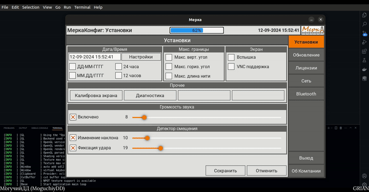

# Kivy/SIMUComp
The project was created and tested on the **Linux Ubuntu 22.04 Wayland** OS



## Information
<div id="information" align="left">
  <a href="https://github.com/MoguchiyDD" target="_blank">
    
  </a>
  <a href="../../../LICENSE" target="_blank">
    
  </a>
  
</div>

## Installed
<div id="installed" align="left">
  <a href="https://pypi.org/project/Kivy/" target="_blank">
    
  </a>
  <a href="https://pypi.org/project/kivymd/" target="_blank">
    
  </a>
</div>

## Commands
```Bash
# Virtual Window (Python)
$ python -m venv <NAME>
# for Linux and MacOS : source <NAME>/bin/activate
# for Windows : <NAME>\Scripts\activate
$ pip install -r requirements.txt  # Installation of Packages 

# RUN
$ cd src
$ python main.py
```
