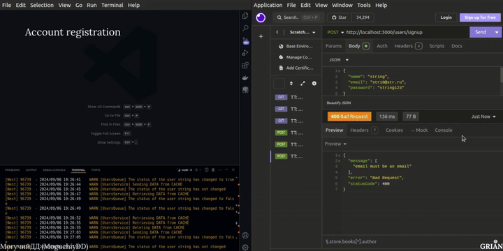

# NestJS/DEMETRA SYSTEMS (1st)
**BackEnd**. User registration and authorization with status updated 10 seconds after logging into the account. If the user is in the cache, data is retrieved from there; otherwise, it is retrieved from the database. There is also a separate endpoint for obtaining the IP address from the proxy server, which is unrelated to the user processes

**Stack**: NestJS, TypeORM, Bull with Redis, Cache with Redis, Axios, Docker Compose

[API endpoint](./src/api.md)



## Information
<div id="information" align="left">
  <a href="https://github.com/MoguchiyDD" target="_blank">
    
  </a>
  <a href="../../../LICENSE" target="_blank">
    
  </a>
  
  
  <a href="https://youtu.be/4eFVjsAiVXo" target="_blank">
    
  </a>
</div>

## Steps before launch
```Bash
$ yarn install
$ yarn doc:up  # Docker Compose
$ yarn start
```
