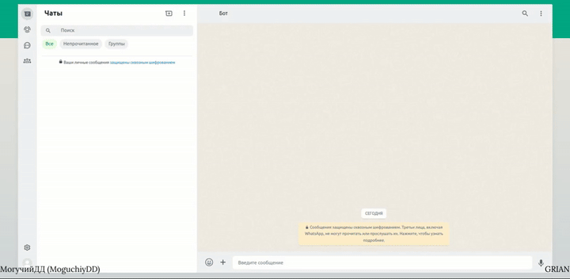

# NestJS/DaniKo (1st) | #2
**WhatsApp Bot** + **FrontEnd**. Creating a chatbot in WhatsApp, and also displaying the progress of the WhatsApp chat bot using React Flow

**Stack**: NestJS, React Flow, whatsapp-web.js, Mongoose, Cache with Redis, Docker Compose



## Information
<div id="information" align="left">
  <a href="https://github.com/MoguchiyDD" target="_blank">
    
  </a>
  <a href="../../../LICENSE" target="_blank">
    
  </a>
  
  
  <a href="https://youtu.be/TbRWnpPTJTc" target="_blank">
    
  </a>
</div>

## URL Addresses
- http://localhost:3000/api : **whatsapp-web.js**
- http://localhost:5173 : **React Flow** → Button&nbsp;&nbsp;&nbsp;&nbsp;opens http://localhost:3000/api

## Indicative colors in a React Flow diagram
- 
- 
- 
- 

## Steps before launch
```Bash
# Main
$ yarn install
$ yarn run doc:up  # Docker Compose

# Apps/API
$ yarn start

# Apps/Client
$ yarn run dev
```
