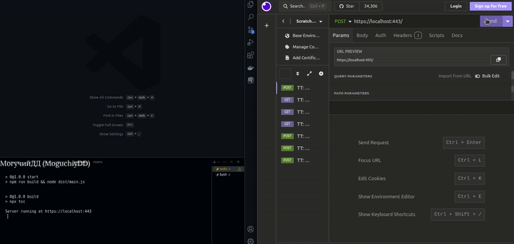

# NodeJS/GREEN API (1st) | #3
**BackEnd**. The 1st microservice sends the user-provided number to the 2nd microservice for processing, and after 5 seconds, the 2nd microservice returns the number, doubled, to the 1st microservice

**Stack**: NodeJS, RabbitMQ, Microservices, Docker Compose



## Information
<div id="information" align="left">
  <a href="https://github.com/MoguchiyDD" target="_blank">
    
  </a>
  <a href="../../../LICENSE" target="_blank">
    
  </a>
  
  
  <a href="https://youtu.be/9i9fZmhnGUA" target="_blank">
    
  </a>
</div>

## URL Addresses
- https://localhost:443/anyNumber : The «_send.ts_» file sends the request to **RabbitMQ**, and the «_receive.ts_» file processes the request from **RabbitMQ** and sends the response via **HTTPS**.
  - **anyNumber**: Any number, e.g., 19

## Steps before launch
```Bash
$ mkdir ssl
$ openssl req -x509 -newkey rsa:2048 -keyout ssl/keytmp.pem -out ssl/cert.pem -days 365
$ openssl rsa -in ssl/keytmp.pem -out ssl/key.pem

$ npm install
$ npm run doc:up  # Docker Compose
$ npm run start  # via root
```
