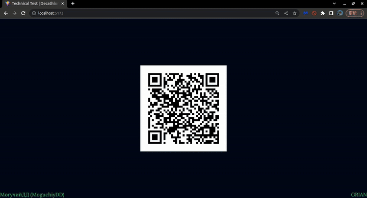

# ReactJS/Decathlon (1st) | #14
**FrontEnd**. A web application for employee attendance tracking. A QR code is generated on the main screen, which is recreated if not scanned within 10 minutes or after navigating to the URL in the QR code. Upon the first launch, the app prompts for the user's name and stores it in localStorage for subsequent scans.

**Stack**: ReactJS, NodeJS, shadcn/ui, Tailwind CSS, SQLite



## Information
<div id="information" align="left">
  <a href="https://github.com/MoguchiyDD" target="_blank">
    
  </a>
  <a href="../../../LICENSE" target="_blank">
    
  </a>
  
  
  <!-- <a href="https://youtu.be/FOalhy-8uvM" target="_blank">
    
  </a> -->
</div>

## URL Addresses
- FrontEnd
  - http://localhost:5173/ : Generate QR
  - http://localhost:5173/timekeeping/:uuid : Employee confirmation after scanning the QR code
- BackEnd
  - http://localhost:5000/api/timekeeping : for 1st time
  - http://localhost:5000/api/timekeeping/confirm : for some times
  - http://localhost:5000/api/timekeeping/create : saved data into database

## Steps before launch
```Bash
$ yarn install
$ yarn run start  # NodeJS + ReactJS

# or ...
$ yarn run start:server  # NodeJS
$ yarn run start:client  # ReactJS
```
