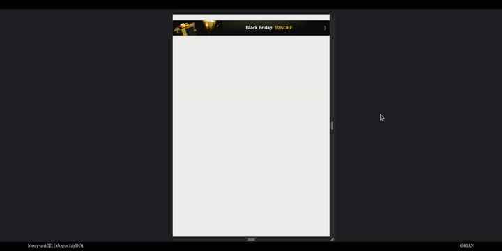

# ReactJS/Tangem (1st) | #4
**FrontEnd**. The «Black Friday» design includes top and bottom labels. The bottom label appears after the top one disappears. If the bottom label is closed, it will disappear and not reappear after the page reloads

**Stack**: ReactJS, SCSS



## Information
<div id="information" align="left">
  <a href="https://github.com/MoguchiyDD" target="_blank">
    
  </a>
  <a href="../../../LICENSE" target="_blank">
    
  </a>
  
  
  <a href="https://youtu.be/-aoauUYUTSc" target="_blank">
    
  </a>
</div>

## URL Addresses
- https://localhost:3000 : main page

## Steps before launch
```Bash
$ npm install
$ npm run start
```
